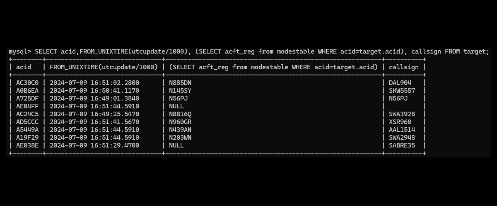
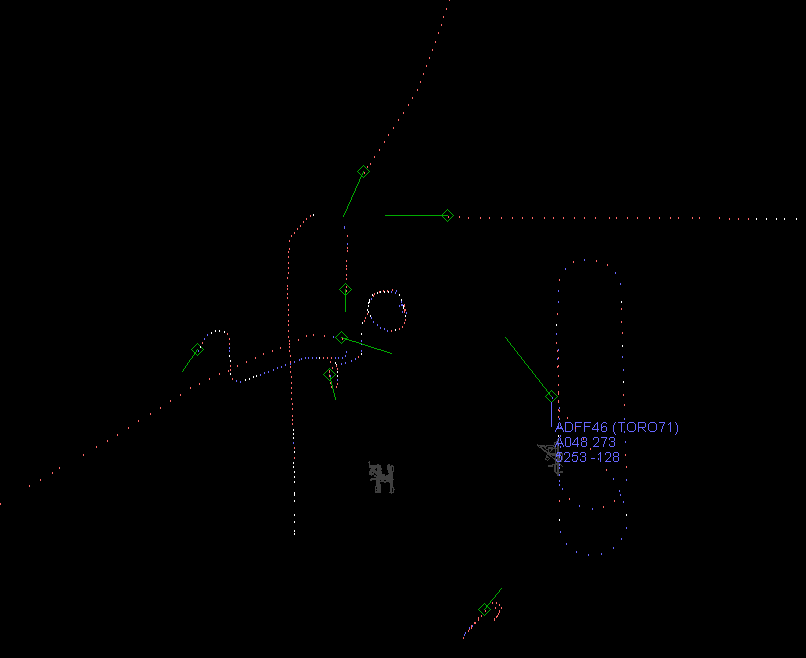

#### ModeSDecoder - A Mode-S and ADS-B Decoder in Java

This was written for the Mode-S Beast Receiver. This is a great little reciever that is based on an FPGA. It would be difficult to adapt it to another receiver, as these things all have different binary protocols to snag the data off of them.

The program drinks-in the serial port data (ignores the Mode-AC if enabled) and creates data structures in order to decode the bits into values we can all understand, and use for a Database Application. If you have two Mode-S Beasts, you can have two antennas pointing in different directions. Then you can run two of these Applications with different config files. Make the second ```radarid``` a different number.

In the TrackView Application, targets with more than one data source have a filled diamond symbol, rather than an open symbol.

This is a hobby program I've played around with to store Mode-S and ADS-B data in a MySQL database, to see what is what flying around the city.

The database is designed so that as new targets come in, their Mode-S ICAO number is added to the ```modestable``` table, and the positions saved in the ```target``` and ```targetecho``` table. Sooner or later this aircraft will land or fade-out, and the database will move it to the ```targethistory``` table. If it pops up again, then it is issued a new flight number. The data in the ```target``` table then, is the current data.

Currently it only updates the registration (N-Number) for USA aircraft, as they are assigned 1:1, and I don't have any info on other countries. I don't do an Internet lookup, as most sites don't allow it for free.



With a database, you can then grab data and display it on a GUI.


