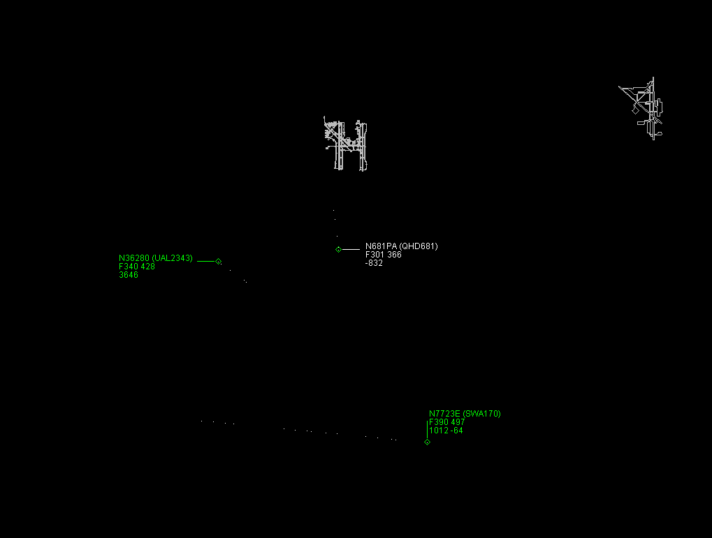

#### ModeSDecoder - A Mode-S and ADS-B MySQL Database Application in Java

This application written for the Mode-S Beast Receiver. This is a great little reciever that is based on an FPGA. It would be difficult to adapt it to another receiver, as these things all have different binary protocols to snag the data off of them.

The program processes the serial port data (ignores the Mode-AC if enabled) and creates data structures in order to decode the data. This decoded information is placed in a MySQL database. Multiple receivers can be used, each running this application and using a separate ```radar_site``` identification in the configuration file.

#### Development Repository
The database is being redesigned. Instead of having a ```target_table``` and a ```target_history``` table, we just have a table of ```targets```.

When new targets are detected, their Mode-S ICAO number is added to the ```icao_number``` table and the decoded basic information saved in the ```target``` table. This table will then reference a ```position_echo``` table. Sooner or later this target will land or fade-out, and the database will mark the target as **inactive**. If it pops-up again, then it is issued a new flight number and marked **active**.

The US registration (N-Number) are also added to the targets after the ICAO number is decoded. These are assigned 1:1 in the US. No other countries are decoded.

#### Running the Application
You must have MySQL installed. Currently version 9.0 is used for development. Import the ```.sql``` file to create the database, tables, and triggers.

You will need OpenJDK 64-bit Java version 22 or newer. Create a directory for the application, and move the ```lib``` and ```.jar``` file into it. Also copy the ```.conf``` file and edit it. The ```lib``` directory contains two files: the serial port connector, and the database connector. The application won't run without them. Your Windows ```PATH``` setting will also need to be modified to include the Java Home directory. Start the program on the command-line using:
```
java -jar ModeSDecoder.jar
```

#### Duplicate Receiver Data
The Mode-S data received has a lot of redundancy in it. Each target may transmit identical information to several radar sites. You will often see three or four transmissions with the same exact data. This application divides the Mode-S into two queues, one for short blocks and one for long. Since the long blocks are used to calculate position, this data is not filtered. On the other hand, the short block duplicates are dropped. This greatly reduces the work of decoding the information, and storing it in the database.

#### TCAS Receiver Data
The DF16 download format has some interesting TCAS data transmitted, and this is stored in the ```tcas_alert``` database table which is referenced to the ```icao_number``` table for both the target and the threat ICAO if known.

#### METAR Internet Data
Airborne targets transmit their altitude based on a standard 29.92 Hg pressure. This altitude may be higher or lower based on the current airport altimeter. The application connects with a NOAA weather site, and the airport selected in your config file is used to collect the current altimeter. This value is then used to provide a correction based on the Pressure altitude. This data is stored in the ```airport_data``` table. The correction value is stored in the ```target``` table for other applications to use.

If there is no airport listed in the ```.conf``` configuration file, this feature is not turned on, and nulls are inserted. This may be desireable if the site has no Internet access.

#### Development Environment
Apache NetBeans IDE 22   
Java: 22.0.1; OpenJDK 64-Bit Server VM 22.0.1+8-16   
Runtime: OpenJDK Runtime Environment 22.0.1+8-16   
System: Windows 11 version 10.0 running on amd64; UTF-8; en_US (nb)   

#### Sample User Application
With a database, you can then grab data and display it on a GUI.



